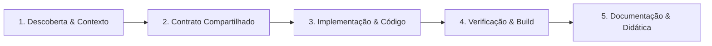

# Universal Engineering Workflow — Delivery Hub

Este documento estabelece o fluxo de trabalho padronizado para qualquer modificação no repositório **Delivery Hub**. O objetivo é garantir consistência, robustez técnica, integridade de contratos e estabilidade em tempo de execução.

---

## 1. Ciclo de Vida do Desenvolvimento (5 Fases)



### Fase 1: Descoberta & Alinhamento de Contexto
Antes de escrever código ou propor alterações:
1. **Verificar os requisitos:** Identificar se a tarefa envolve Backend (`apps/api`), Frontend (`apps/web`), ou ambos.
2. **Consultar as Regras Especialistas:**
   - Para backend: Leia [`.agents/rules/backend.md`](file:///C:/Users/k5h1nj/.gemini/antigravity-ide/scratch/delivery-hub/.agents/rules/backend.md).
   - Para frontend: Leia [`.agents/rules/frontend.md`](file:///C:/Users/k5h1nj/.gemini/antigravity-ide/scratch/delivery-hub/.agents/rules/frontend.md) e a skill [`.agents/skills/commercial-frontend`](file:///C:/Users/k5h1nj/.gemini/antigravity-ide/scratch/delivery-hub/.agents/skills/commercial-frontend/SKILL.md).
3. **Mapear dependências:** Verificar schema do Prisma (`apps/api/prisma/schema.prisma`) e contratos vigentes (`packages/shared/src/index.ts`).

---

### Fase 2: Abordagem Contract-First (Contrato Único)
Qualquer alteração que envolva trânsito de dados entre API e Web **DEVE** seguir esta ordem estrita:

1. **Atualizar `packages/shared` primeiro:**
   - Adicione ou ajuste enums em `packages/shared/src/enums/`.
   - Adicione ou ajuste interfaces/DTOs em `packages/shared/src/types/`.
   - Adicione novos nomes de eventos WebSocket em `WS_EVENTS`.
2. **Exportar no `packages/shared/src/index.ts`**.
3. **Compilar o shared package se aplicável:** Garantir que tipos estão disponíveis para importação nos workspaces `@delivery-hub/api` e `@delivery-hub/web`.

---

### Fase 3: Implementação Especializada

#### Quando no Backend (`apps/api`):
- **DTOs Obrigatórios:** Todo endpoint DEVE possuir classe DTO validada com decorators (`class-validator`).
- **Segurança:** Combine `JwtAuthGuard` + `RolesGuard` + `@Roles(UserRole.XXX)`.
- **Atomicidade:** Operações em múltiplas tabelas utilizam `prisma.$transaction()`.
- **WebSockets:** Se emitir para cliente ou entregador, emita EXCLUSIVAMENTE para a room específica (ex: `order:${orderId}` ou `restaurant:${restaurantId}`).

#### Quando no Frontend (`apps/web`):
- **Zero Emojis na UI:** Use exclusivamente `lucide-react`.
- **4 Estados Obrigatórios:** Todo componente assíncrono deve contemplar Skeleton (loading), Empty State com CTA, Alerta de Erro com retry e Estado de Sucesso.
- **Design System:** Paleta `zinc-*` para neutros, `orange-*` (`brand-*`) para destaque.
- **Feedback Tátil:** Todos os botões e elementos clicáveis possuem `active:scale-[0.98]` e `transition-all`.
- **Chamadas de API:** Utilize `apiFetch()`, nunca `fetch()` nativo solto.

---

### Fase 4: Quality Gate & Verificação Pré-Entrega
Nenhuma alteração é considerada concluída sem passar pelo Quality Gate:

1. **Verificação de Tipos e Build:**
   ```bash
   pnpm --filter @delivery-hub/shared build
   pnpm --filter @delivery-hub/api build
   pnpm --filter @delivery-hub/web build
   ```
   *(Ou execute o build unificado `pnpm build`)*. O resultado deve ter **0 erros TypeScript**.
2. **Validação de Portas e Processos:**
   - Frontend deve rodar estritamente na porta **3000** (`apps/web`).
   - Backend deve rodar estritamente na porta **4000** (`apps/api`).
   - Antes de iniciar dev servers, encerre qualquer processo node zumbi que esteja prendendo as portas.

---

### Fase 5: Documentação & Código Pedagógico
Este é um projeto com forte viés educativo e de excelência profissional:
- **Comentários `// CONCEITO:`:** Cada controller, service, context ou hook crítico deve conter comentários concisos explicando o conceito arquitetural adotado (ex: *Debounce*, *Guard Pattern*, *Optimistic UI*, *Code Splitting*).
- **Relatório Transparente:** Ao reportar conclusões ao usuário, forneça links diretos para os arquivos modificados e destaque as decisões técnicas tomadas.
